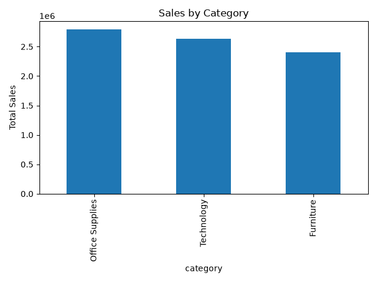
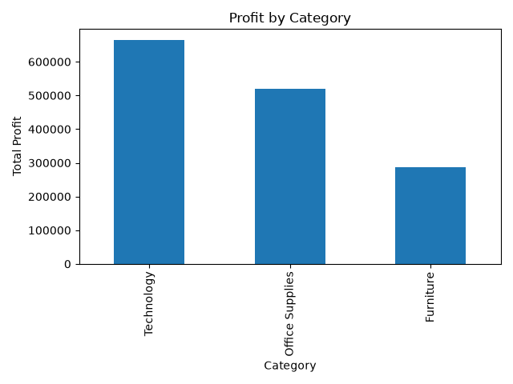
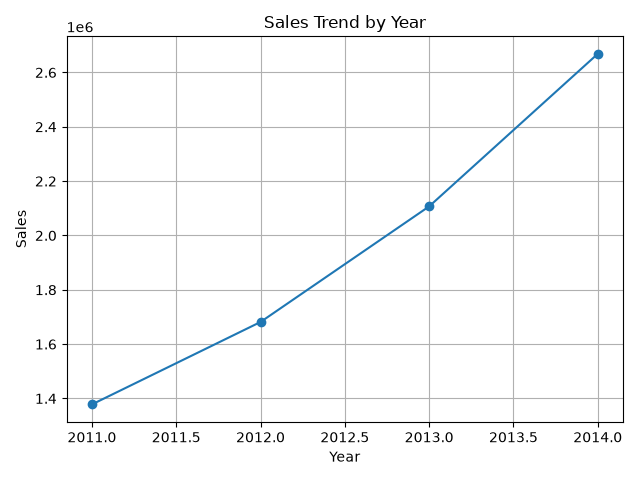
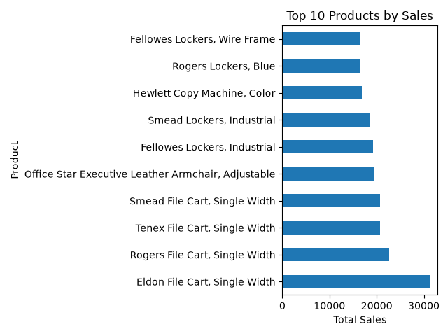

# Sales Data Analysis Project

## Overview
This project analyzes sales data using Python and Pandas.

## Technologies Used
- Python
- Pandas
- Matplotlib
- Git

## Analysis Performed
- Total Sales Analysis
- Total Profit Analysis
- Sales by Category
- Profit by Category
- Sales by Year
- Top 10 Products Analysis

## Project Structure

sales-data-analysis/
│
├── data/
│   └── sales.csv
│
├── images/
│   ├── sales_by_category.png
│   ├── profit_by_category.png
│   ├── sales_by_year.png
│   └── top_10_products.png
│
├── notebooks/
│   └── sales_analysis.py
│
└── README.md

## Results

### Sales by Category

### Profit by Category

### Sales by Year

### Top 10 Products
